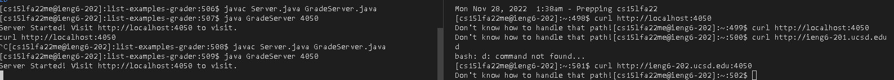

**Lab Report 5**

Here's my code for grade.sh:

```# Create your grading script here

CPATH=".:lib/hamcrest-core-1.3.jar:lib/junit-4.13.2.jar"
rm -rf student-submission
git clone $1 student-submission

echo "Clone successful"

FILE="student-submission/ListExamples.java"
if [ -f "$FILE" ]; then
        echo "ListExamples.java exists"
else
        echo "Wrong file name"
        echo "ListExamples.java does not exist"
        exit 1
fi


cp TestListExamples.java student-submission/
cp -r lib student-submission #copy lib to student-submission
cd student-submission

javac -cp $CPATH *.java
if [[ $? -ne 0 ]]; then
        echo "Failed to compile, score : 0/3." #compiling it correctly +1 points
         exit 1
fi

java -cp $CPATH org.junit.runner.JUnitCore TestListExamples > out.txt

grep -q "2 tests" out.txt
if [[ $? -eq 0 ]]; then
        echo "You passed all tests, score: 3/3"
fi

grep -q "Failures: 1" out.txt
if [[ $? -eq 0 ]]; then
        echo "You failed 1 test, score: 2/3"
fi
```

Unfortunately, I can't access my server without being in the UCSD wifi and I tried using curl but the output is saying stuff like it doesn't work. Here's a screenshot of the error.



If there's a regrading of this lab report, I will try to complete it.
